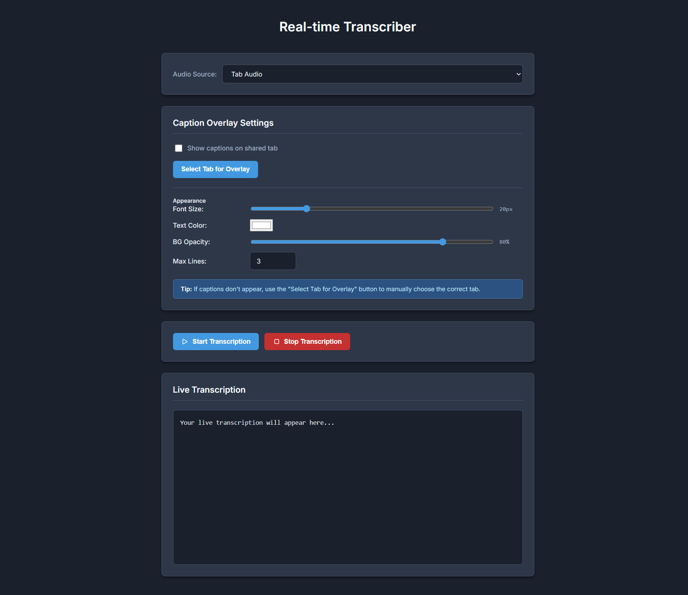

# Real-Time Transcription Browser Extension

A browser extension that captures audio from the tab or microphone, streams it to a Python backend, and displays live captions.

> Built with AI-assisted frontend development.  
> Speech inference pipeline and optimization implemented by me.

<h2>Extension Interface</h2>

  

<h2>Demo Video</h2>

  

---
> Note: Transcribe/Subtitles in the `Demo Video` are generated by the extension they are not from the website
---

## Features
- Real-time speech-to-text
- Chunk-based streaming for low latency
- GPU acceleration (CUDA)
- WebSocket communication between extension and server
- Live caption rendering inside the browser

---

## Tech Stack
**Frontend (Extension)**  
JavaScript, HTML, Chrome Extension APIs

**Backend**  
Python, WebSocket server

**Model & Audio**
- fastwhisper `tiny.en`
- `scipy.signal.resample_poly` for resampling
- CUDA for fast inference

---

## How It Works
1. Audio is captured from the browser.
2. Sent in small chunks to the Python server.
3. Resampled and processed on GPU.
4. Transcription returned instantly.
5. Text displayed as captions.

---

## Accuracy Note
To achieve low latency, audio is processed in small streaming chunks.  
Because of this, some words may occasionally appear cut or slightly incorrect.  
This is a known trade-off in real-time speech systems.

## Disclaimer
The media content used in the demonstration belongs to its respective copyright owners.  
It is shown only to illustrate the real-time transcription capability of the extension.  
I do not own, host, or distribute the video or audio.

## Author
Nikhil Khatri
